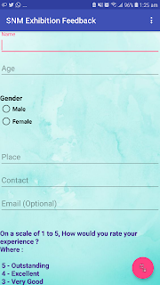
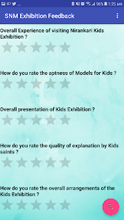
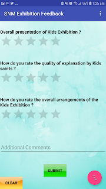
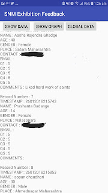
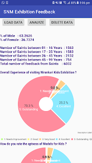
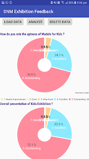
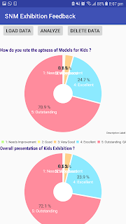

# Exhibition Feedback & Analysis - Android App (Personal Project)

#### Duration: Dec 2017 - Jan 2019Dec 2017 - Jan 2019

Out of curiosity and zeal to learn Application Development, I developed an Android App for Sant Nirankari Kids Exhibition held in January 2018 & 2019 in New Mumbai.

## Functional Description :

A rating based Android app to take feedback from saints visiting the Nirankari Kids Exhibition , around 100,000 saints along with their kids visit Nirankari Kids Exhibition which is part of Nirankari Annual Congregation , Mumbai.

App can be installed on mobile and tablets and all data is synchronized in real time i.e. you can install app on any number of devices and data will be collected from all devices as soon as the device is connected to internet enabling the app to be used in offline mode as well.

The data collected can be analyzed and presented in Pie Charts and Statics within the app.

## Features :

1) Collect feedback from saints sighting their experience of visiting Nirankari Kids Exhibition
1) Single Scroll-able feedback page taking 10-15 Second max for 1 feedback
1) Real-time synchronization of data of each device
1) Available in 3 Languages : English, Hindi & Marathi
1) Offline storage of data to each device
1) Perform Statistical Analysis of ratings within the app and present on TV
1) Categorization of Age group & Gender and visitors per day

## Technical Description :

IDE : Android Studio

Language : Java

SDK : API 27 (Android Nugget)

Database : SQLite and Google Firebase

Storage : CSV for offline and JSON for online

## Outcome & Benefits :

Record Total 6032 feedback collected within 4 days by 25 young volunteers during Jan-2018 at 51st Nirankari Samagam held in Navi Mumbai.

No pen paper required, interesting questionnaire for kids and their parents

Minimum resources required , volunteers used their mobile phones / tablets costing 0 money.

## Screenshots

